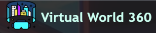
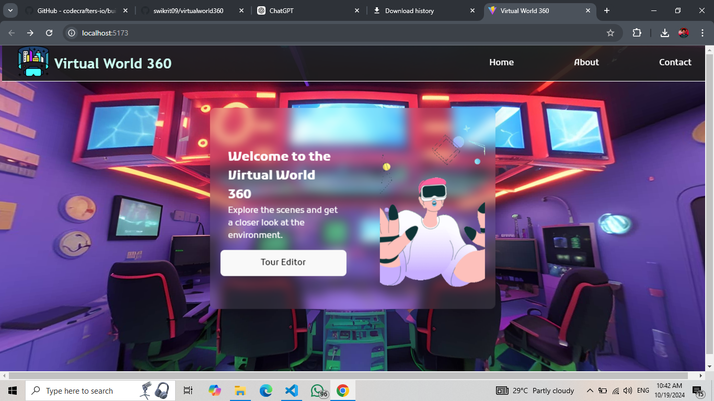
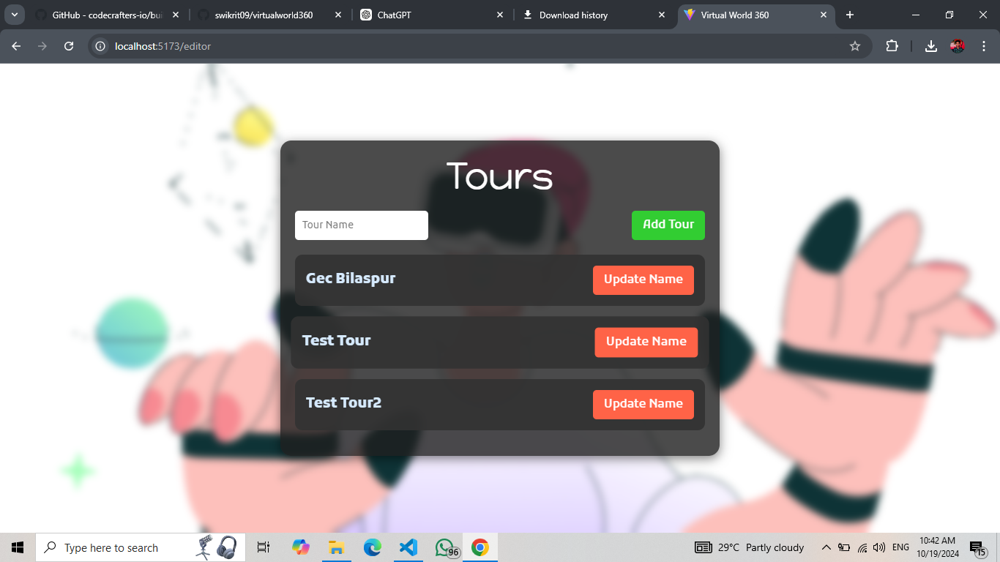
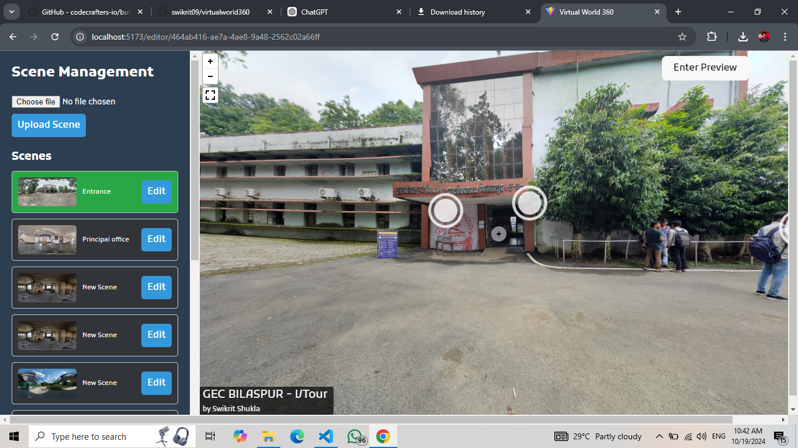
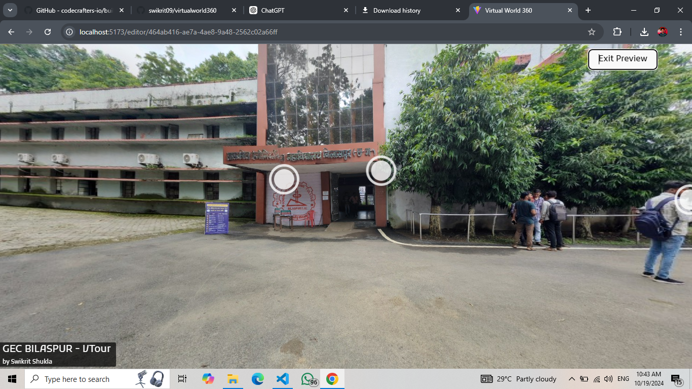

# VirtualWorld360 Project

Welcome to **VirtualWorld360**, a dynamic virtual tour editor that allows users to create immersive 360° tours with multiple scenes, hotspots, and an intuitive editor. This project is built with **React**, **FastAPI**, **MongoDB**, and **Pannellum** for a seamless experience of virtual tours.

## Features

- **Multiple Scenes**: Create tours with multiple scenes, with each scene connected through dynamic hotspots.
- **Hotspot Management**: Add, edit, and link hotspots to different scenes or external resources.
- **Scene Editing**: Rename scenes and update their configuration on the fly.
- **Tour Management**: Create and manage tours with multiple scenes, edit scene names, and add new scenes dynamically.
- **Preview Mode**: View the virtual tour in full-screen, immersive mode to experience it like your end users would.

## Tech Stack

- **Frontend**: React, Pannellum for 360° scene rendering.
- **Backend**: FastAPI with MongoDB for data storage.
- **Cloud Storage**: Cloudinary for image hosting and retrieval.

## Installation

1. Clone the repository:

   ```bash
   git clone https://github.com/swikrit09/virtualworld360.git
   ```

2. Install dependencies:

   ```bash
   # For frontend
   cd client
   npm install
   
   # For backend
   cd server
   pip install -r requirements.txt
   ```

3. Set up your environment variables for **MongoDB**, **Cloudinary**, and any other API keys required.

4. Run the development servers:

   ```bash
   # For frontend
   npm run dev
   
   # For backend
   uvicorn main:app --reload
   ```

## Usage

1. **Add a Scene**: Upload a 360° image, and add it as a new scene.
2. **Add Hotspots**: Place clickable hotspots on the scene, linking to other scenes or external URLs.
3. **Edit Scene**: Use the editor to rename or rearrange scenes as needed.
4. **Preview Mode**: Switch to preview mode to view the tour without the editor interface.

## Demo Video

[](./media/demo_video.mp4)


## Virtual Tour Examples


## Snapshots

Here are a few snapshots from the VirtualWorld360 editor:
### Dashboard



### Tour Creator



### Scene Editor




### Preview Mode



## Contributing

1. Fork the repository
2. Create a new branch (`git checkout -b feature-branch`)
3. Commit your changes (`git commit -m 'Add a new feature'`)
4. Push to the branch (`git push origin feature-branch`)
5. Open a pull request

## License

This project is licensed under the MIT License.


